# Git

[首页](https://git-scm.com/)

## 文档

[Git Book](https://git-scm.com/book/zh/v2)

## 安装

1.  下载安装文件

    [下载](https://git-scm.com/downloads)

2.  运行安装文件，都是下一步即可

3.  设置环境变量，让cmd中也可以使用git command

    
     
4.  设置git 用户信息

    

5.  进入文件夹，右击鼠标，点击 `git bash here`， 运行 git bash
    
    

6.  基本概念

    * 本地仓库
    
    * 暂存区
    
    * 远端仓库
    
    * 分支

7.  常用命令，可以在Git Book 中查看具体怎么使用

        git init
        git clone https://github.com/YuanZhencai/notebook.git
        git remote -v
        git remote add
        git status
        git pull
        git add .
        git commit -am "init"
        git checkout -b "example"
        git merge
        git push
8. ssh key

在访问私有仓库的时候我们会用到用户名密码，但是由于每次操作都要输入用户名密码，很麻烦，所以用ssh key 来代替用户名密码去认证

*   查看自己的秘钥

```
➜  ~ cd ~/.ssh
➜  .ssh ls
id_rsa      id_rsa.pub  known_hosts

```

*   生成秘钥

```
➜  .ssh ssh-keygen
Generating public/private rsa key pair.
Enter file in which to save the key (/Users/lining/.ssh/id_rsa):
/Users/lining/.ssh/id_rsa already exists.
Overwrite (y/n)? y
Enter passphrase (empty for no passphrase):
Enter same passphrase again:
Your identification has been saved in /Users/lining/.ssh/id_rsa.
Your public key has been saved in /Users/lining/.ssh/id_rsa.pub.
The key fingerprint is:
SHA256:gRbgN4l2nZHdtq4VhHRlWXXeWz3GL25bMBTdnLfwcr4 lining@liningningdeMacBook-Pro.local
The key's randomart image is:
+---[RSA 2048]----+
|    ... .+.o..+=B|
|   . . =.oo.+oo+O|
|    + B +  o .++B|
|   . + . .  oo.+=|
|        S  . .B..|
|            o. = |
|           o  o o|
|          .  . E |
|              .  |
+----[SHA256]-----+

```

*   查看公钥

```
➜  .ssh cat ~/.ssh/id_rsa.pub
ssh-rsa AAAAB3NzaC1yc2EAAAADAQAB....
```
*   添加到公钥到自己的ssh-keys

    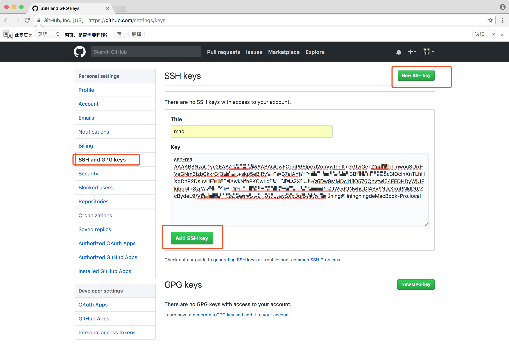

        
## SourceTree
   
[首页](https://www.sourcetreeapp.com/)

## 安装

[Mac](https://downloads.atlassian.com/software/sourcetree/SourceTree_2.6.2c.zip)

[Windows](https://downloads.atlassian.com/software/sourcetree/windows/ga/SourceTreeSetup-2.1.11.0.exe)

## 使用

* 打开 SourceTree

    

* 新建本地仓库

    
    
* 克隆远端仓库

    
    
* 导入已有仓库

    
    
* 查看工作空间

    
    
* 右击待定的文件，可以添加到暂存区

    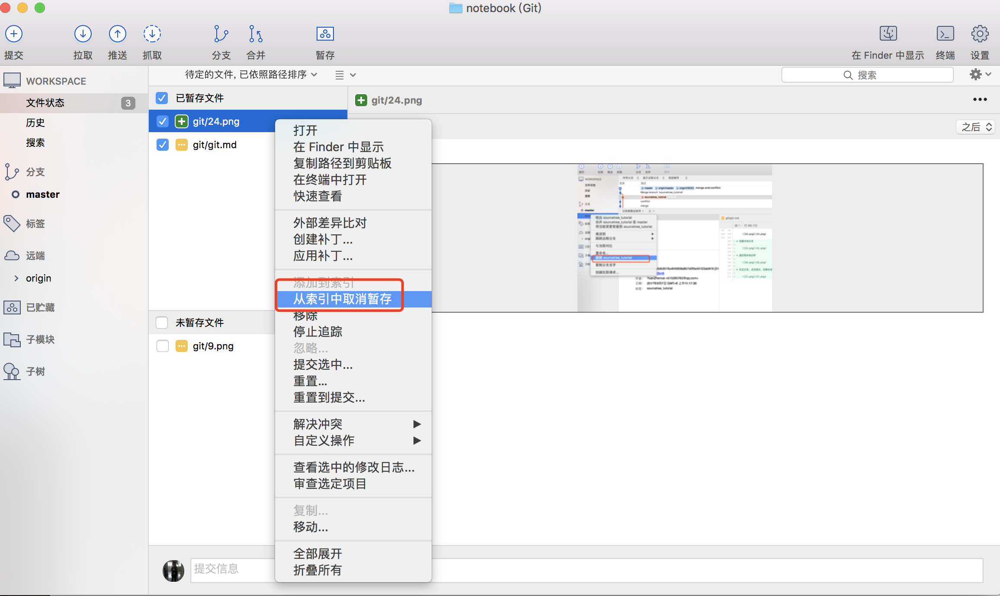

* 提交到本地仓库

    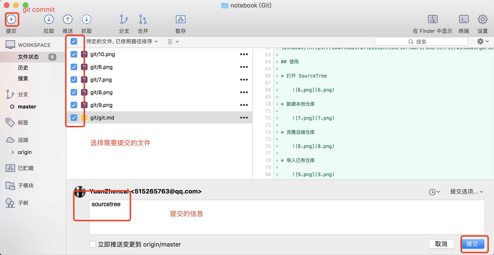
    
* 推送到远端仓库

    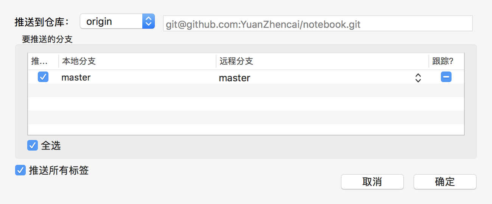

* 拉取远端仓库代码

    

* 创建本地分支

    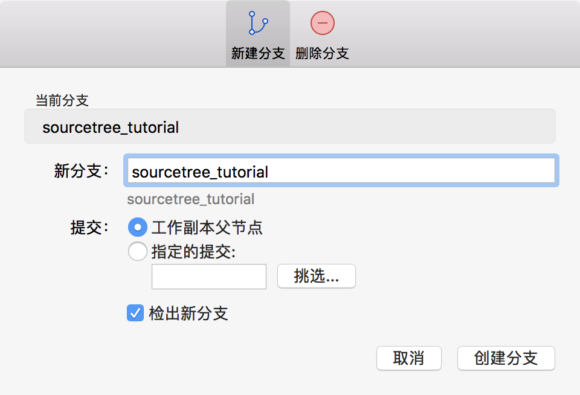
    
* 提交到本地分支

    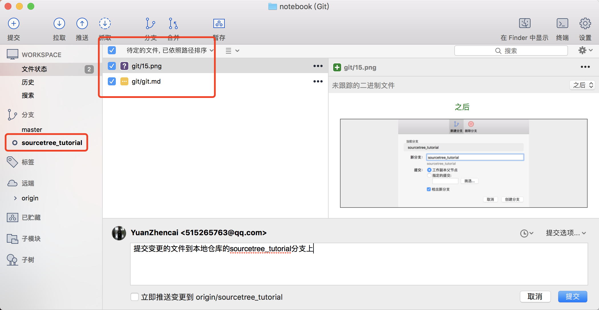
    
* 右击分支，点击检出，切换本地分支，master

    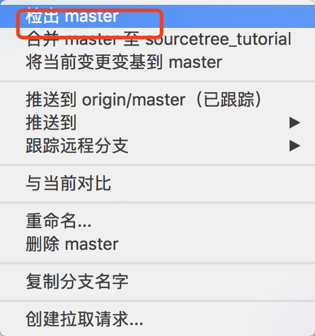  
      
* 合并代码

    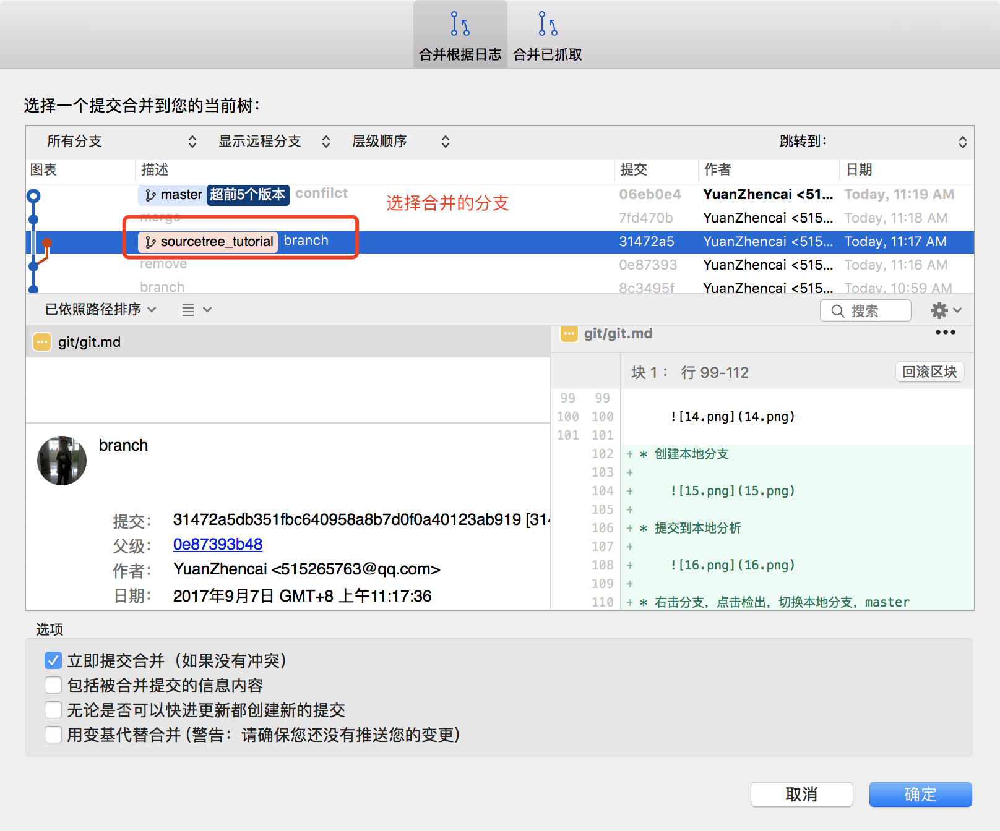

* 通过外部工具解决冲突

    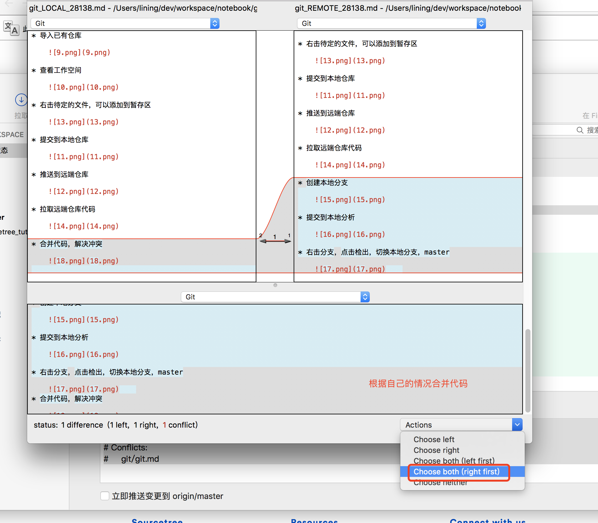
    
* 提交解决冲突

    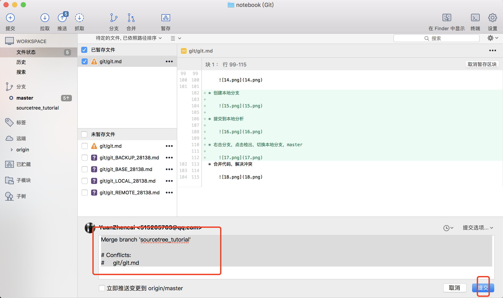

* 删除分支

    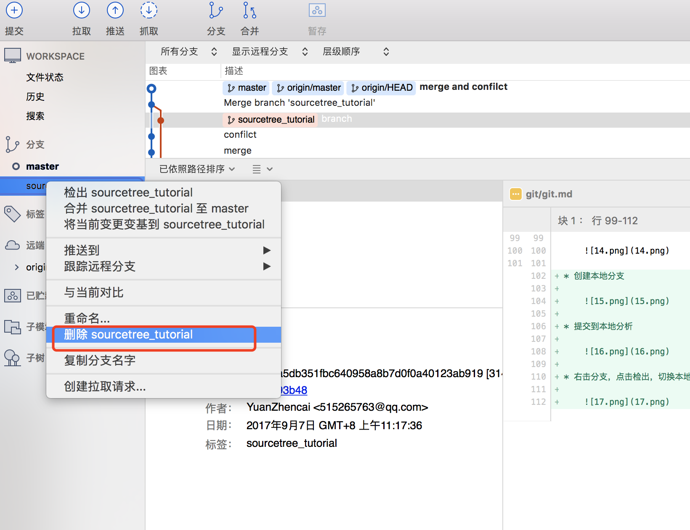
