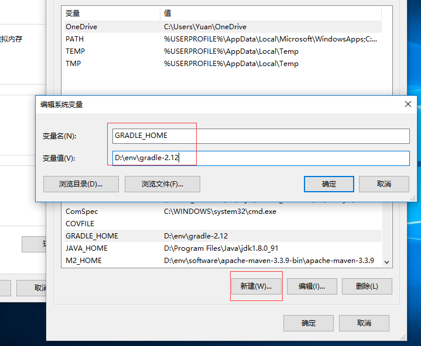
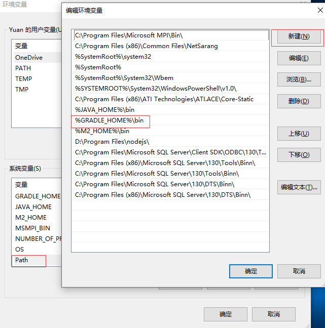
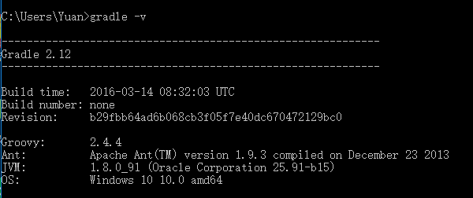

# Gradle

[首页](https://gradle.org/)

## 文档

[Docs](https://gradle.org/docs)

## 安装

[https://gradle.org/install](https://gradle.org/install)

1.  [下载](https://gradle.org/releases)

2.  解压

        unzip gradle-x.x-bin.zip

3.  配置 *GRADLE_HOME* 环境变量

    

4. *%GRADLE%/bin* 添加到系统的 *PATH* 环境变量里

    

5.  测试, `gradle -v`

    

## 阿里云镜像

[init_scripts](https://docs.gradle.org/3.5/userguide/init_scripts.html)

在 *USER_HOME/.gradle/* 目录添加 `init.gradle` 文件，添加阿里云nexus仓库

    allprojects {
        repositories {
            maven{ url 'http://maven.aliyun.com/nexus/content/groups/public/'}
        }
    }

## 加速

在 *USER_HOME/.gradle/* 目录添加 `gradle.properties` 文件

    # 开启线程守护，第一次编译时开线程，之后就不会再开了
    org.gradle.daemon=true
    # 配置编译时的虚拟机大小
    org.gradle.jvmargs=-Xmx2048m -XX:MaxPermSize=512m -XX:+HeapDumpOnOutOfMemoryError -Dfile.encoding=UTF-8
    # 开启并行编译，相当于多条线程再走
    org.gradle.parallel=true
    # 启用新的孵化模式
    org.gradle.configureondemand=true
