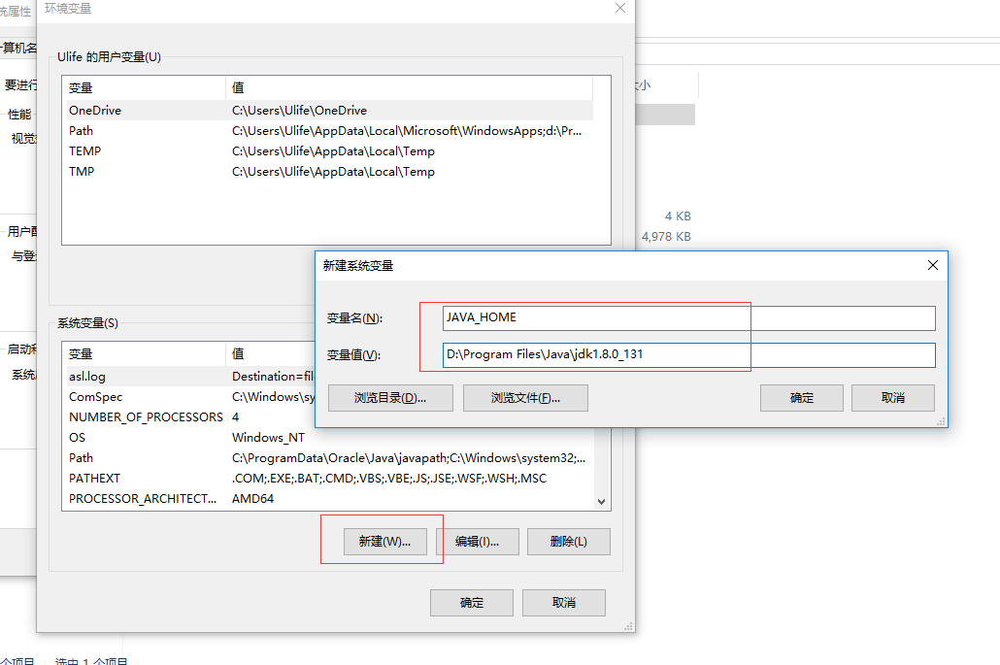
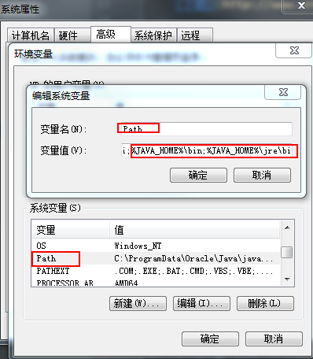
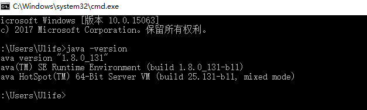

# JDK

[首页](http://www.oracle.com/technetwork/java/javase/overview/index.html)

## 文档

[API](http://www.oracle.com/technetwork/java/api-141528.html)

## 安装

1.  下载安装文件

    [下载](http://www.oracle.com/technetwork/java/javase/downloads/jdk8-downloads-2133151.html)

2.  运行安装文件，都是下一步即可

3.  设置环境变量，计算机→属性→高级系统设置→高级→环境变量

     

4.  系统变量→新建 JAVA_HOME 变量，在变量值最后输入 `D:\Program Files\Java\jdk1.8.0_131`

     

5.  系统变量→寻找 Path 变量→编辑，新建环境变量 `%JAVA_HOME%\bin;%JAVA_HOME%\jre\bin;`

    * win 7, 只要在后面添加 `;%JAVA_HOME%\bin;%JAVA_HOME%\jre\bin` 就好了，注意 ; 号不要少了
        
     

    * win 10
    
     

6.  系统变量→新建 CLASSPATH 变量，填入 `.;%JAVA_HOME%\lib;%JAVA_HOME%\lib\tools.jar`

     

7.  检验是否配置成功，运行 `cmd`, 输入 `java -version`

     

