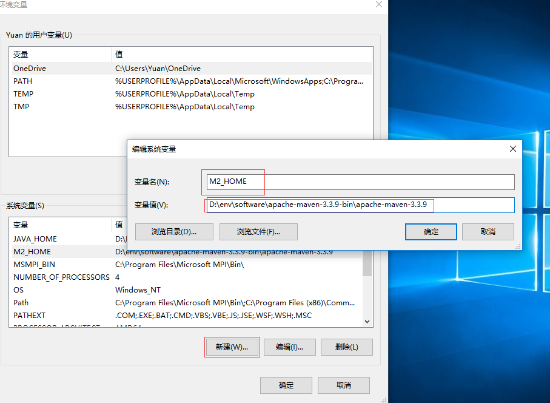
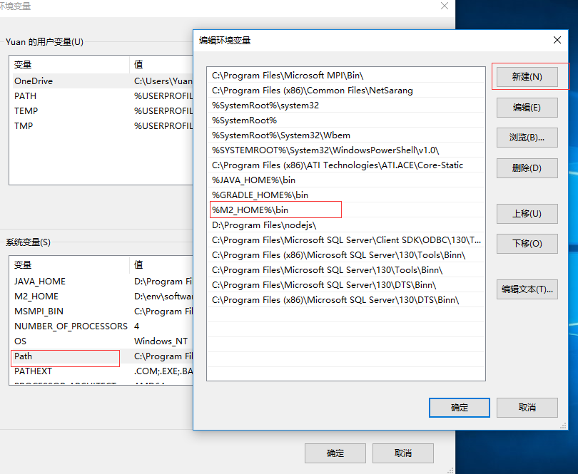
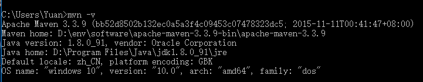

# Maven

[首页](http://maven.apache.org/)

## 教程

[Guides](http://maven.apache.org/guides/index.html)

## 安装

[http://maven.apache.org/install.html](http://maven.apache.org/install.html)

1.  [下载](http://maven.apache.org/download.cgi)

2.  解压, `unzip apache-maven-x.x.x-bin.zip` 或者 `tar xzvf apache-maven-x.x.x-bin.tar.gz`

3.  配置 *M2_HOME* 环境变量

    

4. *%M2_HOME%/bin* 添加到系统的 *PATH* 环境变量里

    

5.  测试, `mvn -v`

    

## 配置

[http://maven.apache.org/configure.html](http://maven.apache.org/configure.html)

## 阿里云镜像

[settings](http://maven.apache.org/settings.html)

在 *USER_HOME/.m2/* 目录添加 `settings.xml` 文件，添加阿里云nexus仓库

    <settings xmlns="http://maven.apache.org/SETTINGS/1.0.0"
      xmlns:xsi="http://www.w3.org/2001/XMLSchema-instance"
      xsi:schemaLocation="http://maven.apache.org/SETTINGS/1.0.0
                          https://maven.apache.org/xsd/settings-1.0.0.xsd">
      <mirrors>
        <mirror>
          <id>aliyun.com</id>
          <name>Aliyun Nexus Repository</name>
          <url>http://maven.aliyun.com/nexus/content/groups/public/</url>
          <mirrorOf>central</mirrorOf>
        </mirror>
      </mirrors>
    </settings>

