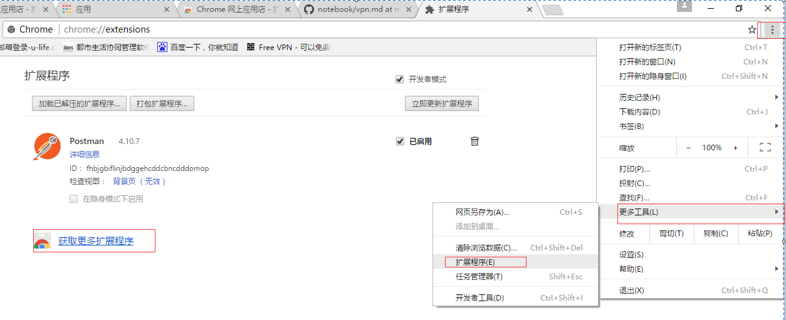
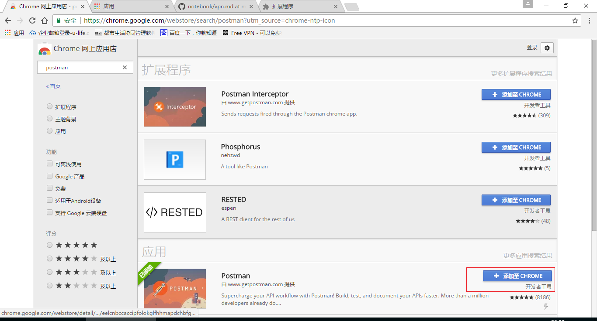
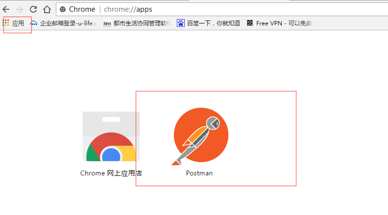
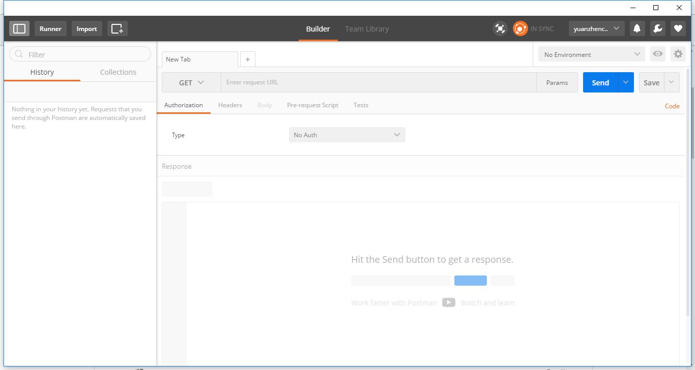

# Postman

[首页](https://www.getpostman.com/)

## 文档

[Documentation](https://www.getpostman.com/docs/)

## 安装

1.  进入Chrome 网上应用商店，国内有可能不能访问 Chrome 网上应用商店，需要[vpn](../vpn/vpn.md)翻墙.

     
    
2.  搜索 postman 扩展程序，并添加至 Chrome

     

3.  查看 postman 扩展程序

     

4.  进入 postman 扩展程序

    
