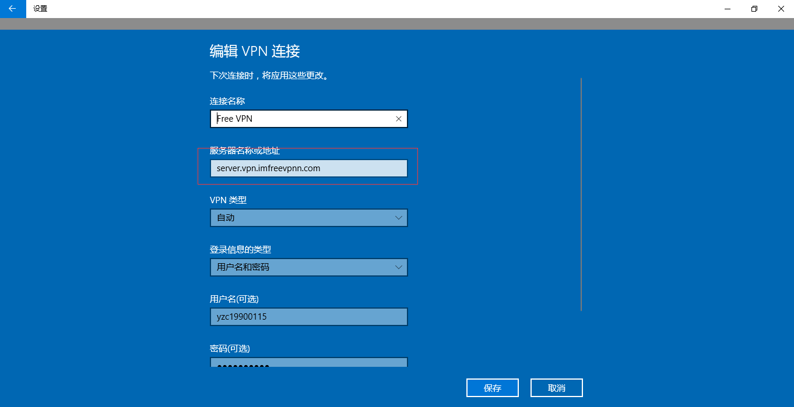
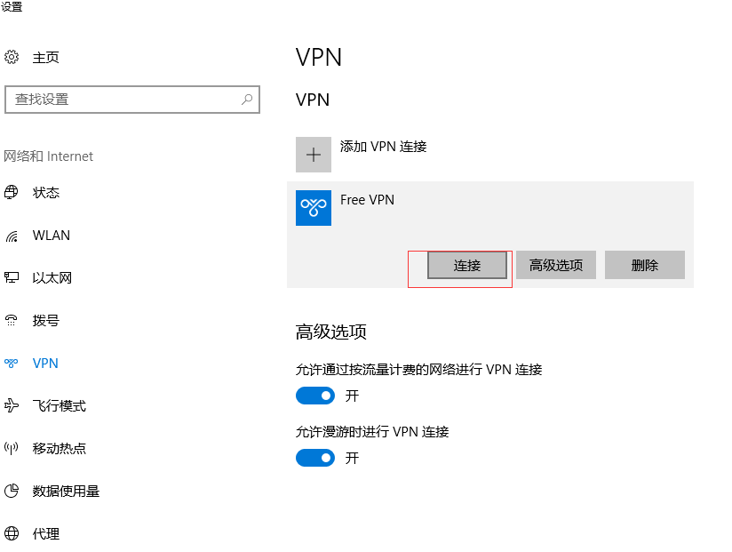

# Free VPN - 可以免费使用24小时的VPN

[首页](https://www.imfreevpn.org)

## 帮助

[如何使用](https://www.imfreevpnn.com/howtouse.html)

每天需要用VPN的时候在首页上注册下账号，就可以使用24小时

服务器地址：
    
    server.vpn.imfreevpn

免费版支持 PPTP, LT2P (预共享秘钥：`imfreevpn`)

由于使用方法很简单，请自行百度搜索使用教程。

## win10

1.  进入添加vpn页面

     

2.  填写vpn信息

     

3.  连接vpn

    